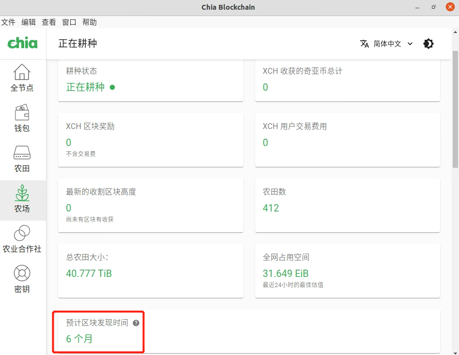
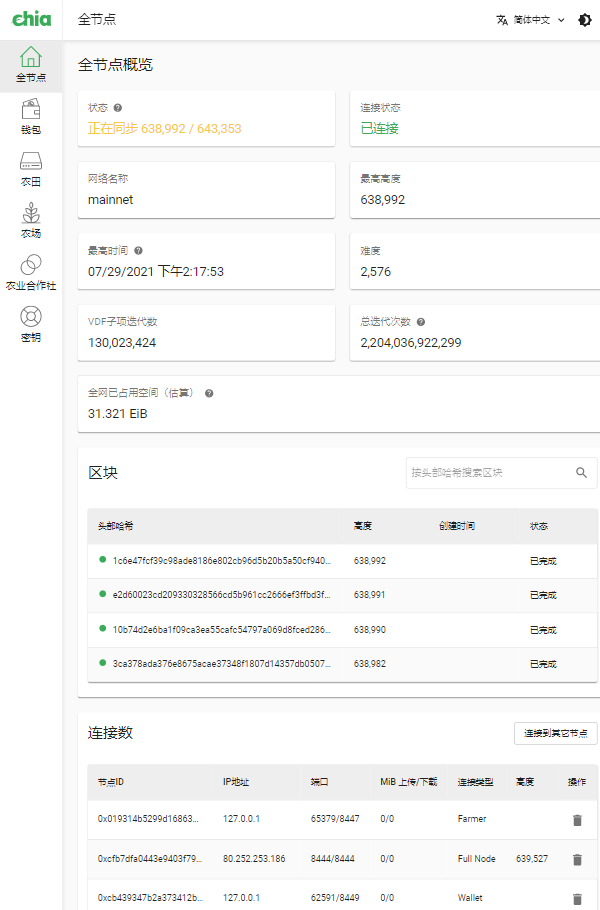
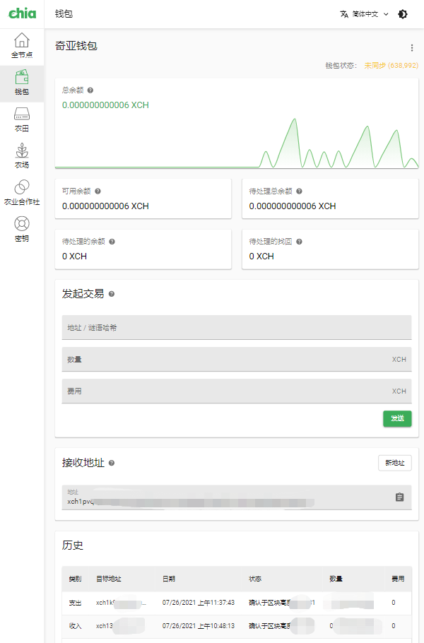
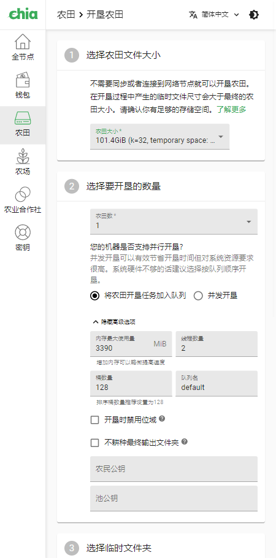
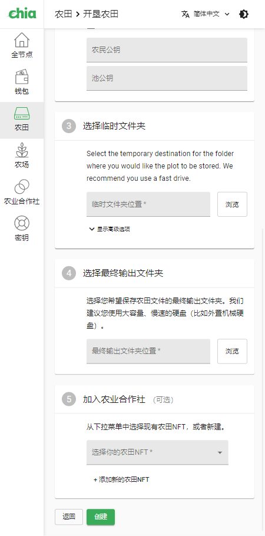

翻译自[2021年9月27日版本-79#](https://github.com/Chia-Network/chia-blockchain/wiki/Beginners-Guide/12f8a89f3fac29b25ee2f3df1efdd53e6f1c469e)
***

# 新手指南

## 开始之前

**Don't worry,be happy!** 先搞清楚Chia是什么，以及如何绘制一块“农田”（plot）来供耕种（挖矿）使用。这样由易到难，由简到繁，循循渐进的方式更有利于学习了解chia。

## Chia的基础知识

### 一言以蔽

Chia是一种全新的区块链技术，使用计算机创建的“农田”（plots）文件，可以通过耕种（挖矿）来赚取Chia区块网络的代币：XCH。

### Chia概述

Chia是一种新型的加密货币，它是基于用户创建的“农田”（plots）文件，“农田”内包含有开垦过程中所预存储的随机数据。由于Chia在通过区块网络验证“农田”（plots）来进行时空证明（POST:proof of space and time）时所需的计算资源非常少，这使得Chia区块网络在运行过程中不仅迅速而且节能。相较于那些依赖显卡以及定制矿机的区块链系统，它们在计算过程中（区块工作量证明-POW）需要消耗大量的电力能源，而Chia的区块工作量证明方式大大改善了这一现状。同时，Chia还在脚本、脚本环境、密码学、可用性及可扩展性上做了很多改善，旨在构建一个简单、安全、强大的区块链系统。

Chia软件由多个功能不一的服务进程组成，对于初学者来说，最重要的几个进程是：
* 节点（node）-确保你同步至最新的区块网络。
* 农民（farmer）-把工作量证明（农田）信息发送给收割机。
* 收割机（harvester）-验证你的农田（plots）是否符合区块系统的工作量证明。如何你有当前网络最优的证明文件，你将赢取区块奖励（XCH）。

## 新手该如何开始

首先，把重点放在如何正确安装并配置Chia软件以及制作农田（plots）文件上。有两件重要的事情：
* 确保你已连接到其他节点并同步到最新区块。
* 着手制作“农田”（plots）然后开始“耕种”（挖矿）。

开始的方式很简单，根据你的计算机系统来[安装相应版本的Chia软件](https://www.chia.net/download/)并打开GUI客户端。Windows版的在安装完后会自动启动，MAC则的需要从应用目录中打开软件。当软件启动后，会开始连接到网络并同步至最新区块，这取决于你的网络情况是否良好，一般来讲，同步至最新区块至少需要1天时间。当你与区块上的每一个节点同步的时候，会下载全部的区块数据，里面包含了所有已经处理验证过的信息，Chia区块网络的数据将会被保存在本地。每一个安装运行Chia的计算机都将会有一份整个区块网络数据的副本。

### 耕种（挖矿）基础

开始“耕种”（挖矿）意味着你已经拥有了一些“农田”（plots），同时还需要运行Chia软件来定期验证它们是否找到了最优的证明。

在这里，我们需要先区分一下**GB（109 字节）和GiB（230 字节）**：因为在接下来讲解中，GiB格式会大量使用。你只需要知道，1 GiB约等于1.074 GB(230 除以109 )。大多数的硬盘的容量都是用GB来描述的，这是需要注意的一件事情。

Chia安装完毕以后，用户就可以使用Chia应用程序来生成“农田”（plos）文件了。根据你的硬件状况，一块农田（plot）的制作时间将花费4至12小时乃至更长（目前单任务开垦农田有更快的方式，使用了CPU多线程来加快开垦速度，有兴趣的自行研究[madMAx43v3r的chia-plotter](https://github.com/madMAx43v3r/chia-plotter)）。每块“农田"的大小将在大约101[Gib](https://simple.wikipedia.org/wiki/Gibibyte)（108GB）.使用计算设备储存这些已生成的“农田"并开始“耕种”（挖矿），就可以开始赚取区块代币了（XCH）。
每一个“农田”（plot）文件包含大量的预制算力，它们被存储在链表中的哈希单元格内。依靠预制算力内符合工作证明的哈希值，使得赢取代币XCH成为可能。区块奖励的发放会在2至3秒内完成，以便用户在赢取区块奖励代币（XCH）后交易使用。“农田”（plots）文件内有非常多的哈希值，你不需要删除为你赢得区块奖励的农田，它可以持续不断的“耕种”（挖矿）下去。就当前区块网络的情况来看，农田至少可以耕种五年而不失效。

### 命令行界面-CLI

Chia的[命令行界面](CLI-Commands-Reference.md)相较于命令行GUI客户端，CLI提供了更多高级功能，比如更好地利用硬件来优化农田的制作过程。建议你使用图形界面客户端了解Chia的基础功能以后再使用命令行软件. 

### 期望值

当你制作完成一些农田并开始耕种时，你会在“农场”界面中看到“预计区块发现时间”。不过，这里显示的只是估算的时间值。实际花费的时间可能是预计的3 ~ 4倍。打个比方，“预计区块发现时间”显示2天，那实际可能要花5 ~ 8天，当然，有时候也可能更早赢得区块奖励，甚至赢得更多。这很正常，这只不过是短期内的运气事件。所以，当你增加更多的农田文件时，“预计区块发现时间”显示的时间会更准确贴合实际。

## 如何寻求帮助

* 仔细阅读[本维基文档](README.md)，绝大多数用得着的信息都在这儿了。
* 加入到[Chia的Keybase聊天频道](https://keybase.io/team/chia_network.public)中来，你可以在#beginner和#support板块获得帮助。
* 在Github上提交问题。

## 客户端使用指南

### 全节点

这个界面主要显示Chia区块网络的变化情况，节点与主网络同步状态。本机将会存储Chia主网的所有区块数据，并与网络中的其他节点持续同步更新。
- *区块*  ： 实时显示当前区块网络最新区块状态的信息。
- *连接数* ：与你相互连接的其他用户的区块节点会在这里显示。

### 钱包

这里可以看到你所获得的Chia代币（XCH）余额。
- *历史*：显示钱包的历史交易数据。

### 农田

你创建的农田会在这里显示。正常且主网认可的最小农田文件每个大小差不多是101 GiB。又称为k32-农田（101 GiB/109 GB）。

- *GiB* ：全称：gibibytes，是一种老的容量计算格式。现在通常用，尤其是硬盘厂商使用GB（gigabytes）来计算容量。前面的章节阐述过，1 GiB ≈ 1.074 GB。
- *关于农田* ：每个农田文件可以当作是一个彩票集，里面的每张彩票都有机会赢取区块奖励。制作的农田文件大小大概是101 GiB（差不多108 GB）。里面有很多哈希表数据（类似于excel表格），表中的每个哈希单元格都随机对应其他表中的哈希单元格。计算机在制作农田的过程中不断地计算，并将可能的符合证明条件的答案塞进数以百万计的哈希单元格内，这就是为什么制作一个农田文件需要花费大量时间。就目前Chia区块网络的发展状态来看，K32-101 GiB格式的农田文件大概可以用5~10年。现在只用K32格式的农田文件就够了，K33以及更大格式的农田文件并非必须。

### 农场

这里会显示你有多少农田。在最上面一行列有你当前账号总共"耕种"（挖矿）获得的Chia代币XCH数量。包括所有可用农田文件的总大小也在这里显示，单位为GiB。打个比方，你有2个K32格式的农田，那“总农田大小”就会显示你有0.2[TiB](https://en.wikipedia.org/w/index.php?title=Tebibyte&redirect=no)的农田文件。这也意味着你为Chia区块网络提供了0.2TiB的存储算力。总大小的计算方式：101 GiB X 2 = 202 GiB。

- *最近尝试过的证明*：显示当前区块网络最新广播的挑战，可以把这个哈希值当作是彩票的中奖号码。每9.375秒就会有一个新的挑战机会出现，Chia软件会扫描检查已有农田中是否包含符合证明的哈希值。上一个9秒所广播的挑战会为赢得证明的人奖励2个xch区块奖励。所以每18.75秒会产生一个新区块。

- *最新的区块挑战* ：区块挑战的过程包含了2个重要的步骤。第一步，农田需要通过初步筛选。第二步，检查已经通过初步筛选的农田中是否有符合当前挑战的证明（哈希值）。在客户端"最近尝试过的证明"界面中，会显示一列需要挑战的哈希值（默认5个一列，可以自己调节显示数量）。假设你有157块农田，当区块网络每广播一个挑战的时候，Chia软件都会去扫描一遍这些农田，如果这其中有1个或者n（小于157）个通过了第一步中的筛选，那筛选这列就会显示1/157或者n/157，同时会对通过初筛的农田进行大约7次的读取，以便更详细的查找是否含有符合挑战的哈希值（证明）。如果你赢得了挑战，这里不会显示任何信息，因为发放区块奖励的交易速度很快，你可以去你的钱包查看相关信息。

根据区块所广播的证明挑战先后，本机通过初筛的农田的数量会随着时间顺序依次排列。

挑战证明成功是非常珍稀的，Chia区块网络每18.75秒才会产生一个获奖者。区块网络每9.375秒会广播一个全网挑战证明，客户端会检查你所有的农田是否通过[农田筛选（plot filter）](FAQ#什么是农田筛选机，为什么我的农田无法通过初筛？)。每次挑战全网会有1/512的农田通过初筛，所以可想而知你能有多少农田可以通过筛选。不管怎样，每天还是有4608次机会来赢取2个Chia代币（xch）。

如果农田筛选列表停止滚动，那意味着当前区块数据尚未同步到最新，需要检查网络重新同步。

## 使用Chia客户端软件

### 开垦农田

1. 点击右上角“开垦农田”这个绿色按钮。
2. 开始制作K32格式的农田（101GiB）.制作农田所使用的本地缓存空间至少要有239GiB（256GB）.
3. 选择要制作的农田数量。
    1. *队列模式开垦*：假设你选择开垦5个农田，那么在该模式下会在开垦完1#农田以后，再继续开垦2#农田，以此类推。
    2. *并发模式开垦*：同时开垦若干个农田。需要确认拥有足够的缓存空间。即单个农田需要101 GiB + 239 GiB = 340 GiB（365 GB）的空间，多个并发开垦，总空间由并发个数累计而得。
    3. *高级选项*： 默认值是根据你选择开垦的农田格式来自动调整的。新手建议不推荐自行修改高级选项。
        1. *内存最大使用量*： 内存的增加对速度的提升效果一般。但是，如果你给开垦任务分配了过少的内存（K32格式的农田至少需要4GB内存）或者太多（超过实际已有内存大小），那么农田在开垦的过程中可能会中断失败。
        2. *线程数量*： 默认为2个线程。
        3. *桶数*： 默认为128个哈希桶，桶数的增加会减少内存的使用量，这样做可以部分提高开垦的速度。
        4. *队列名称*： 这个选项对管理并发及队列开垦任务很有用。假设总共要开垦10个用，同时开垦2个农田，那就把其中5个设置为队列任务并命名为“队列一”,剩下五个设置为“队列二”任务。
4. 选择临时文件夹： 开垦农田的位置。会产生128个临时文件（这取决于你前面设置的桶数），然后合并压缩这些临时文件成为一个农田文件。在开垦的过程中会产生239 GiB（256 GB）的缓存文件，最终它们会被压缩成一个K 32格式的农田文件（101 GiB）。
    1. 推荐使用SSD或或者NVME存储设备来进行开垦，但需要了解[SSD/NVME的读写寿命](./SSD-Endurance.md)。
5.  选择最终输出文件夹是为了存储你所开垦的农田文件，这些农田文件将在后续的耕种（挖矿）过程中来替你赚取Chia的代币（XCH）。农田文件的存储设备可以是计算机的内置硬盘也可以是通过USB连接的移动存储设备。当然也可以是网络存储设备，但为了方便耕种时计算机遍历你农田内的证明，需要保持你的网络连接畅通，以免错过区块奖励的响应时间（至少在30秒以内）。做好开垦农田的任务计划，存储设备很快就可以装满农田。
6. 点击创建，农田的开垦任务就启动了。

 

#### 农田的制作过程
普通电脑创建一个农田大概需要消耗9到20小时，高级一点的设备需要4到8小时。农田的开垦过程总共包含了4个阶段，需要对7个哈希表进行运算操作。

阶段:
1. **对哈希表进行（1~7）正向运算:** 这个过程会在临时文件目录内创建你所设置的相应桶数的临时文件（默认是128个），当7个哈希表都运算完成以后，农田开垦的进程大约完成42%。
2. **对哈希表进行（7~1）反向运算:** 7个表完成反向运算后，进程到达61%。
3. **将已正反向运算后的哈希表进行成对压缩:** 7张表都被压缩成一个农田文件后，进程完成了98%。
4. **向表中写入检查点:** 删除SSD/NVME中所有缓存文件，并开始将已完成的农田文件移动到最终目录文件夹。此时整个开垦过程全部完成。

| 阶段（Phase） | 步骤（Step）|进度（Progress）%  |
| :---: | :------------------------- | ---------: |
| 1     | Computing table 1          |         1% |
| 1     | Computing table 2          |         6% |
| 1     | Computing table 3          |        12% |
| 1     | Computing table 4          |        20% |
| 1     | Computing table 5          |        28% |
| 1     | Computing table 6          |        36% |
| 1     | Computing table 7          |        42% |
| 2     | Backpropagating on table 7 |        43% |
| 2     | Backpropagating on table 6 |        48% |
| 2     | Backpropagating on table 5 |        51% |
| 2     | Backpropagating on table 4 |        55% |
| 2     | Backpropagating on table 3 |        58% |
| 2     | Backpropagating on table 2 |        61% |
| 3     | Compressing tables 1 and 2 |        66% |
| 3     | Compressing tables 2 and 3 |        73% |
| 3     | Compressing tables 3 and 4 |        79% |
| 3     | Compressing tables 4 and 5 |        85% |
| 3     | Compressing tables 5 and 6 |        92% |
| 3     | Compressing tables 6 and 7 |        98% |
| 4     | Write checkpoint tables    |       100% |

#### 注意事项
建议使用新增的SSD或者NVME存储设备来开垦农田，而不是使用电脑设备原有的硬盘（尤其是MAC或者windows笔记本这些无法更换nvme的计算设备）。
如果在开垦过程中中断了，需要删除所有的缓存文件。需要注意的是，缓存目录中已完成的农田文件（101GiB）别误删了。

## 专业术语
'证明'：存储在农田文件中，农田里有数百万的预先计算好的数据块，称之为'空间证明'。Chia代币的产出是一个抽奖过程。想要让农田中的空间证明有更高的中奖概率来赢得区块奖励，就需要拥有更多的农田，即拥有更多的空间证明。如果你有全网1%的算力（农田），那么你就有机会赢取全网1%的区块奖励。Chia网络每天会新增4608个区块，每个区块将会奖励2个XCH，也就是说每天会有9216个Chia代币（XCH）生成。

Chia软件在耕种过程中会尝试去挑战证明（可以理解成刮刮彩），假设当前区块高度（代表特定时间点）的中奖号码是2021，Chia软件会开始在农田文件中查找每张哈希表，来寻找表内最接近2021这个中奖号码的证明（哈希单元格），这里就是“时空证明”中时间的来源。只有更高质量的证明才有机会赢取区块奖励。

区别于其他“工作量证明”（POW）共识机制的区块链项目（比如比特币，以太坊等），Chia采用的是“时间和空间证明”共识机制。总的来讲，Chia软件的基础设施包括了这么几项，Full Nodes(节点)，Farmers(农民)，Harvesters(收割机)，Timelords(VDF服务器)，Pools(矿池)，Wallets(钱包)以及可视化GUI界面。这其中，农民创建了空间证明以及区块，“timelord”通过VDF（可验证单线程延迟函数）来为区块添加时间证明，这是一个通过大量计算后生成的加密证明，可以在很短的时间内通过验证，表明已经过去了一定的时间（比如30秒）。所以并不是全世界所有的节点同时在做验证计算（类似于POW），而是少数的节点在验证获胜的空间证明，由于证明是加密过的，它们是无法变更、被破坏的，所以这个共识机制是非常安全的。

在Chia区块网络的运转过程中，消耗电力仅存在于“农田开垦”以及“耕种农田”的环节上，其中主要是耕种过程中硬盘的电力消耗（每个硬盘大约10W），还有CPU同步节点所需（很少的消耗）。相比依靠ASIC矿机（功率上千瓦一台）的比特币以及显卡矿机（300W左右一张显卡）的以太坊区块链项，你可以把工作证明（POW）共识机制的模式当作是数百万矿机同时制作彩票并等待开奖的方式，而且这么多彩票只有一张才能中奖，其他的都会作废，这个过程需要持续消耗大量电力。Chia则只需要少量的电力，因为每块农田（plot）至少可以抽奖抽五年以上。

## 硬件设备
'SSD固态硬盘'： 很多人使用SSD/NVME固态硬盘设备来开垦农田（P图）。如果想要并发开垦2个及以上的农田，则那固态硬盘的容量至少需要1Tb.

如果你的电脑主板比较老的话，可以购买PCIE扩展卡来安装NVME/SSD固态盘,以此作为缓存文件的目录文件夹。除了通过主机内部扩展，也可以使用USB或者火线（苹果电脑）接口来添加NVME/SSD设备。开垦单个农田大概需要6个小时，如果并行开垦多个农田，那平均每个大概需要8个小时甚至更久。SSD/NVME固态硬盘设备主要是用来存放开垦农田过程中的临时文件。

随着农田的不断开垦，需要做好储存农田的计划，硬盘的需求很快就从GB级别到达TB级别。可以使用USB来扩充硬盘数量，也可以通过主机内的sata接口或者PCIE扩展卡来增加硬盘的数量。

**同步问题 - 查看全节点分栏**

比较一下最高时间跟你电脑的时间是否一致。如果有30分钟以上的不同，那就表示没有同步到最高区块，需要点击菜单-查看-强制重载（Force reload），五分钟后会开始重新启动节点同步功能。点击完重载后，需要选择你的账号，这个过程不会影响开垦农田进程。

**加入官方讨论组 [_chia_network.public_ Keybase](https://keybase.io/team/chia_network.public):**

* \#公告（announcements）  -- 主要会公布新版本信息
* \#初学者（beginner）  -- 初学者多看看，能看到很多新手问题的问答。
* \#耕种设备（farming hardware）
* \#综合问题（general）
* \#中文区(lang_zh)
* \#农田开垦（plotting）
* \#杂谈（random） 
* \#测试网（support ）

## 常见问题
更多的问题请查看[FAQ](FAQ)章节。

问：如果停电了会发生什么?

答：正在开垦的农田将无法使用并继续开垦了，当你重新启动Chia的时候，需要重新开垦刚刚的农田，并且删除缓存目录中的所有断电前所创建临时文件。这些临时文件是一次性的，在完成开垦任务之前，它们不会被自动删除。如果不删除这些临时文件，那你在并行开垦多个农田时，可能会因为过期失效的临时文件占用缓存目录的空间，而导致开垦（P图）任务无法继续。别担心，所有已经存在开垦完毕的农田是完好无损（除非你的硬盘也坏了）。

问：可以使用USB3.0扩展SSD/NVME固态硬盘来当作临时文件的缓存目录么？

答：使用windows系统这么做的话，效果不太理想，传输速度不够快，如果什么时候USB接口拥堵了，那就会导致农田无法使用。通过USB开垦农田可能只适合单任务进程，但不适合并行开垦。最好的方式就是使用PCIE扩展卡来增设SSD/NVME固态盘。开垦第一块农田的时候速度很快，有人说同时开垦两块农田时花费的时间会显著增加。技术在不断地进步，所以保持好奇心，有问题多与社区成员一起交流。

问:如果某一块农田中的哈希值赢得了挑战证明，需要删掉这块农田么？

答：并不需要删除，实际情况是，一块农田里有30万个哈希值，如果有一个哈希值使用了，那还有相当多的哈希值足够使用大约5年左右。

农民（Farmer）和收割机（Harvester）的区别

收割机检查验证农田并把符合挑战的证明提交给农民，农民提交打包这些信息到区块中，并生成新的区块。

### 检查Chia区块高度是否同步（此问题与“同步问题 - 查看全节点分栏”一致）
*Chia区块链软件* : 每一个用户都有一份全网区块信息副本存储在计算机内，这是为了让所有人都保持同步。点击“全节点”分栏，向下滚动滚条查看区块还有已连接的节点。如果区块界面的最新创建时间与现实时间相差30分钟以上，那代表区块未与主网保持同步。检查方式如下:全节点分栏-查看最高时间-在下面的连接数界面查看已连接的节点，确认本机节点高度与其他节点保持一致。同时，你的钱包区块高度也需要与主网最新高度保持一致。钱包的区块高度差距一般保持在个位数，如果与主网相差几十甚至上百个区块，那表明钱包尚未完全同步。

窗口-顶部菜单栏-点击查看-强制刷新（Force Reload）。这个操作需要花5~10分钟来重新与主网连接继续同步，需要选择相应的账号来进入Chia界面，这个操作不会影响正在开垦的农田。

### 如何判断windows的Chia客户端是否正常运行
当你第一次操作Chia软件无法判断是否正常运行时，下面会列举一些有帮助的信息。
Chia软件的配置信息都在config.yaml里。

config.yaml的文件路径：c:/Users/ (Your username)/.chia/mainnet/config.yaml

修改配置文件之前先关闭Chia软件。
使用记事本打开配置文件，在中间可以看到 `log_level: WARNING` 这个参数,关闭config文件。运行Chia一段时间，打开log文件，你需要重点关注是否有WARNING相关信息的出现。

log文件的路径：c:/Users/ (Your username)/.chia/mainnet/log/debug.log  日志文件的信息是非常有用的，当一个日志文件达到20MB了，会自动创建一个新的日志文件继续记录。如果你觉得日志文件太多了，可以删除这些历史日志。

日志文件里可以看到类似的信息：
*07:02:41.663 harvester src.harvester.harvester:INFO     1 plots were eligible for farming f53c496e80... Found 0 proofs. Time: 0.00500 s. Total 8 plots*

意思是:Chia正在运行中-- Chia证明筛选机包含了2个部分，这里表示Chia有一个农田通过了初筛，现在正在这块预存算力（哈希值）的农田内寻找符合当前挑战的证明。大多数时候会显示找到0个证明。但系统依旧是正常运转着的，能否赢得区块就涉及到前面讲的期望值了。该行日志的最后，显示你当前耕种的农田总数（符合主网要求的）。

### 日志文件
下面是一组系统正常运转时的日志信息：
 ***
*9:32:00.322 full_node full_node_server        : INFO     <- new_signage_point_or_end_of_sub_slot from peer 68b376e5846696df3510822ea527d0899ac6183f261e8858119235cd24903720 193.91.103.92.*-
***
*9:32:00.278 farmer farmer_server              : INFO     <- new_signage_point from peer 62d37909657e183dcd702b66d0e694474f907361f5981eceaba00878e84419c4 127.0.0.1.*
***
*09:32:01.806 full_node full_node_server        : INFO     -> respond_peers to peer 202.185.44.200 e5b7f06ba6ece8698917e0e22971aef8602972de81efe379d693b2baa0dffc24.*
***
*09:32:08.063 full_node full_node_server        : INFO     -> request_signage_point_or_end_of_sub_slot to peer 74.138.106.114 b567363c3a96c13366ef2dbff2e080da77f310875a8beda7c1c07246173c3a06.*
***
*09:32:08.202 harvester harvester_server        : INFO     <- new_signage_point_harvester from peer 5bfd9af9bc76270cf76746255db9a435dca56b9adb37f5d1daec71e3c699c807 192.168.0.44.*
***
*09:32:08.211 harvester src.harvester.harvester : INFO     0 plots were eligible for farming fec1fff66e... Found 0 proofs. Time: 0.00200 s. Total 8 plots.*
***
日志最后一行显示：在本机的当前时间（9点32分8秒211毫秒），有8个农田在耕种，找到了0个证明，扫描农田时消耗2毫秒。这就表示，Chia软件已识别农田，并开始耕种。

Chia社区的小伙伴们都非常乐于助人，建议初学者在keybase聊天室内问问题时，请选择初学者板块。