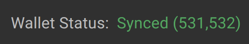
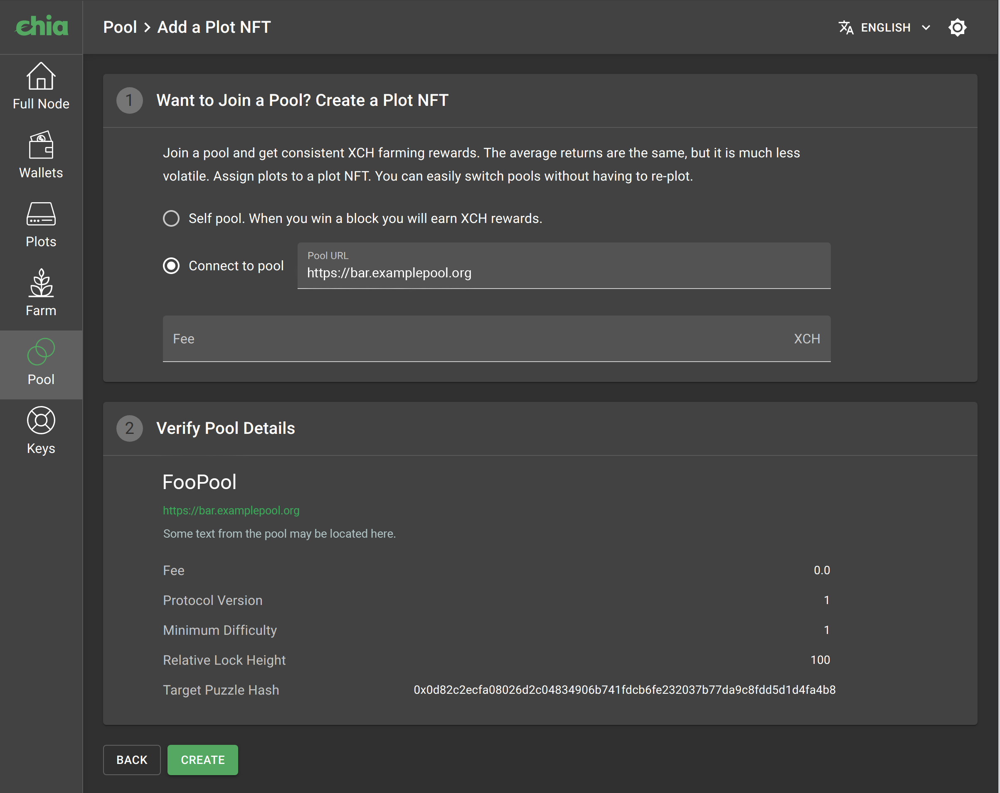
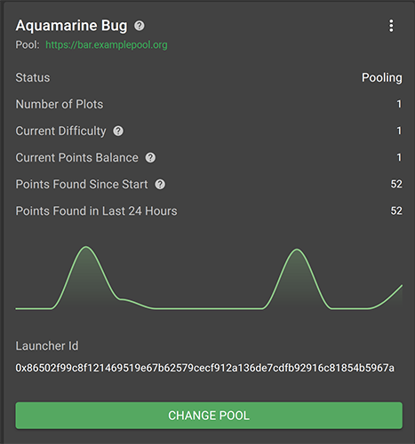

- [How to Start Pooling in 6 Steps](#how-to-start-pooling-in-6-steps)
- [Additional Information](#additional-information)

[Link to Frequently Asked Questions](https://github.com/Chia-Network/chia-blockchain/wiki/Pooling-FAQ)

Due to the increasing network space (netspace), winning blocks in Chia is a very difficult task, and can take months even years for
users with multiple hard drives farming Chia. Pooling can allow you to win consistently, in small amounts. For example,
a user earning 2XCH per 20 weeks while solo farming, can instead earn 0.1XCH per week, in a much more consistent schedule.

The Chia pooling protocol allows you to assign plots to a "Plot NFT", which is kind of like a contract on the blockchain
which you control, and in which you can set your currently assigned pool. You can also change the pool that the Plot NFT
is assigned to at any time.

With the pooling protocol, your farmer will communicate with a specific pool server, and send proofs of space very often to that pool, in order to prove how much plotted space you have. Therefore the pool can keep track of the space of
each of its members (the farmers), and whenever one of the members wins a block, the pool can distribute rewards proportional to
the amount of space that each farmer contributed.

Therefore, pooling is kind of like lottery insurance: all of the members participate in the Chia "lottery", and whenever
one member wins, the pool gets the reward and distributes it to all of the members, minus a small fee. 1.75 XCH is divided between the pool members, and 0.25 XCH goes directly to the farmer that won that block. As the winner of the block, you would also earn a small piece of that 1.75, based on how much space you have, and how the pool decides to distribute rewards.

## How to Start Pooling in 6 Steps

Old plots that were made for solo farming (OG plots) cannot be used with the new portable pool protocol. In order to participate in 
pooling, you will have to create new plots. However you can farm both OG and pooling plots on the same computer.

### Step 1:  Sync your full node and wallet
To start, you need to update to Chia 1.2, and sync up your Chia full node and wallet. In the full node tab, the status should be "Synced",
and in the wallet tab in the top right, it should say `Synced` as well.



IMPORTANT: If you are using the same key (24 words) on more than one computer, you should update both computers to 1.2+ before creating your plot NFT. If you have already created the plot NFT and the second computer is running a version older than 1.2, it will not be able to see the plot NFT. This can be fixed by shutting down the application on the second computer, and deleting the `~/.chia/wallet/db` folder and all files inside of it.

### Step 2: Receive some XCH
To start pooling, you first need a tiny amount of chia in your wallet. You can ask your friends to send you some mojos 
(1 mojo is 0.000000000001 XCH), or get some using  https://faucet.chia.net/. You can use the receive address on the "Wallets" page, and you can also create new receive addresses. Any of the receive addresses can be used, they are all part of the same wallet.

### Step 3: Create Plot NFT
Once you have some XCH in your wallet, go to the pool tab, and click on "Add a Plot NFT". You now have two options:
1. Self pooling: this plot NFT will not be connected to any pools, and the 1.75 XCH will go directly into your wallet. This is different than OG (original) plots, since OG plots are locked in to self farming forever.
From CLI: 
```bash
chia plotnft create -s local
```
2. Connect to pool: join a pool, and immediately start pooling, as soon as you make some plots.
From CLI: 
```bash
chia plotnft create -s pool -u https://bar.examplepool.org
```

Note that even if you choose 1, you can join a pool later, and you can switch your pool at any moment. If you decide
to join a pool, enter the url (must start with _https://_), and look at the description. If you agree, create the Plot
NFT, and wait for it to be confirmed (click only once). It can take several minutes for it to be confirmed and to show up in the Pools tab.
You only need 1 plot NFT.



### Step 4: Add Plots
You can now start creating plots for this Plot NFT, which means these plots will be "pooling" and can earn rewards
more often. Click on the 3 dots in the Plot NFT that you want to create plots for, and select "Add a Plot".
This will select this Plot NFT in the plotting screen. If you don't select anything or select "None", that will make an OG plot. The plot will be forever tied to the Plot NFT that you choose (or forever OG).

If you are using the CLI or a 3rd party plotter, hover your mouse over the question mark in the Plot NFT page, and copy
the Pool Contract Address. This is the address that you need to use while plotting, by specifying the `-c` argument.
Note: When plotting using the CLI for pooling, do NOT use the `-p` argument anymore, only `-c`. You can still specify
the `-f` argument like before, and other arguments have not changed. 


### Step 5: Manage your Plot NFT
You should see your plots in the Plot NFT interface. The status should say "Pooling". From here, you can see your
difficulty, the number of points earned, and how many points the pool thinks you have (points balance). 

The difficulty is a value that is different for each plot NFT, which determines how hard it is to find a proof
for those plots. This will get set automatically so that your plots find proofs very often (every few minutes or hours).
Each proof found will award you with `difficulty` points. Farmers with many plots will have a higher difficulty, to keep disk usage low.

Points are a way to count how many proofs your plots found. Each k32 plot will get on average 10 points per day,
independent of what the difficulty is. Points are NOT the same as Chia (XCH). Points are just a value that reflects how much farming you have done. Think of it as an accounting tool. It is the responsibility of the pool to periodically reward you with XCH based on how many points you obtain, and then reset your points back to 0. 

To change pools, click on the "CHANGE POOL" button and enter the new pool URL. Note that changing pools has a waiting
period that can be from a few minutes to an hour or so. Please do not shut down your application while this is happening. You can change pools as many times as you want, and there is no penalty or registration required for doing so. Be aware that if you change pools, your old pool is not obligated to pay you anymore, more than they already have.

You should ensure that your points found in the last 24h are accurate. You should be obtaining around 10 points per day
per k32, so if you have 100 k32 plots, you should be getting around 1000 points per day. Make sure your points balance
is going up. After you get paid, the points balance will reset to zero. Points will come at random times, since finding proofs is still random. Therefore expect a lot of variability and times of both good and bad luck.



### Step 6: Wait for Payouts
You are now done. If your points balance is increasing, you are properly pooling, and you should check your pool to see 
how often payouts happen, and to optionally log in to a pool interface.

## Additional Information

### Multiple Plot NFTs
You can have multiple plot NFTs on the same key, and they can all be farmed at the same time. You can also farm
original (OG) plots as well.

### Multiple Computers
You can take your 24 words and enter them into a different computer, and when it is synched, the current Plot NFTs and
pool information will be automatically downloaded from the blockchain. All information about your pool, plot NFTs, and smart contract addresses is completely backed up on the blockchain, and can be recovered using the 24 words.
Make sure to read the important note on step 1, about updating to new version on all computers.

### Multiple Keys
You can also have multiple keys farming at the same time, but be careful with this. Each key has to sync separately,
and if you change pools in one computer (computer A), then you must sync up your wallet on computer B in order to farm
it separately. If computer B has multiple keys, make sure to sync each key up to the latest changes in the Plot NFT.


### Pool Fees
Pool fees refer to the small cut that pools take when they distribute rewards to farmers. 

### Blockchain Fees
Blockchain fees are fees are paid to the creator of the block (farmers), to incentivize them to include your transaction. Fees are currently 0, but they are likely to rise as the blockchain gets more usage. When fees rise, you might have to
pay small amounts of Chia to make transactions. Sending XCH to an address is a blockchain transaction, but creating a plot NFT, or changing pools is also a transaction, which requires fees. The user interface will be updated to include fields for fee amounts, and guidance will be provided here when fees become necessary.

### Invalid State
If you enter into an invalid state, you need to re-join or change to self-pooling again. This can happen if you close
the GUI before a pool switching operation has finalized. Please click "change pool", and re-enter the pool URL, or switch to self pooling. Sometimes you might need to wait a bit for the pool switching timeout to finish.


### Payout addresses
The block reward is divided into two components, the 1.75 XCH pool portion and the 0.25 XCH farmer portion. The 0.25 XCH will go to your farmer target address, which is the same as the OG plots. This is configurable in the Farm tab of the GUI, or in the `config.yaml` under farmer.xch_target_address.
The 1.75XCH gets paid out to the pool, and the payout instructions that the pool will use to pay you can be set in the config file in the pool_list section.


### Self Pooling
If you are self-pooling, you will additionally need to claim your rewards after winning a block. This can be done from the GUI or CLI as well. There is no time limit for this, but if you do not claim your rewards before switching to a pool, the pool will be able to claim those rewards, and you will lose these funds.

### Remote Harvesters
Remote harvesters work the same way as always. They do not need to have any keys, and you can plot directly on another machine with the `-f` and `-c` arguments. The farmer machine needs to have the private key for the `-f` key, and the private key for the wallet that created the plot NFT. Your harvesters will find proofs more often when pooling, since the difficulty is lower. Remote harvester plots will now be visible by doing `chia farm summary`.


### Command Line Interface
Using the CLI, you can perform the same operations as with the GUI. There is a new command, called `chia plotnft`. Type `chia plotnft -h` to see all the available sub-commands:

```
» chia plotnft -h
Usage: chia plotnft [OPTIONS] COMMAND [ARGS]...

Options:
  -h, --help  Show this message and exit.

Commands:
  claim           Claim rewards from a plot NFT
  create          Create a plot NFT
  get_login_link  Create a login link for a pool. To get the launcher id, use
                  plotnft show.

  inspect         Get Detailed plotnft information as JSON
  join            Join a plot NFT to a Pool
  leave           Leave a pool and return to self-farming
  show            Show plotnft information
```

To create a Plot NFT, use `chia plotnft create -u https://poolnamehere.com`, entering the URL of the pool you want to use. To create a plot NFT in self-farming mode, do `chia plotnft create -s local`.
To switch pools, you can use `chia plotnft join`, and to leave a pool (switch to self farming), use `chia plotnft leave`.
The `show` command can be used to check your current points balance. CLI plotting with `create_plots` is the same as before, but the `-p` is replaced with `-c`, and the pool contract address from `chia plotnft show` should be used here.