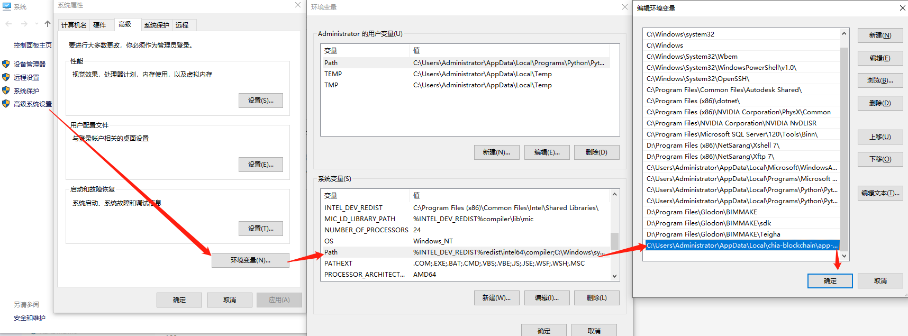

## 请先浏览新手指南
这是一份更简洁的指南。如果你不太了解Chia的话，建议先阅读[新手指南](Beginners-Guide)。

# 安装
查看[安装教程](INSTALL),根据你的系统选择相应的方式来安装Chia客户端。只支持64位操作系统。

所有的配置文件及都储存在 $CHIA_ROOT 环境目录下或者在 ~/.chia/mainnet/（linux就在/home/user/.chia/mainnet/，Windows的话就在C:\Users\user\.chia\mainnet）下，目录下有区块数据以及日志文件。你也可以把chia目录添加到系统环境变量中去，这样就可以更方便的使用chia命令。如果你更改了Chia的环境目录，需要手动迁移配置文件，或者通过命令 `chia init` 来迁移配置文件。

如果你使用MacOS或者Windows安装使用的话，首次运行时需要创建账号密钥，建议你保存好你的助记词。接下来就可以在农田分栏里开垦农田了，或者也可以使用命令行工具。这将会消耗比较长的时间，具体时间取决于[农田格式解析](k-sizes)。如果你想参与主网的耕种（挖矿），需要开垦一些K32格式的农田或者更高格式的（K33等），使用[M.2 PCIe NVMe SSD](https://en.wikipedia.org/wiki/M.2)开垦一个K32农田目前大概需要10个小时，同时，SSD设备需要至少有232GiB作为开垦过程中缓存文件的空间，以及101.3GiB来储存最终的K32农田文件。是否能有机会赢得区块奖励取决于农田的格式大小。

目前主网所支持的最小农田格式为K32.在Beta 8及以上的测试版本中开垦的K32农田，同样支持在主网上使用。

如果你想要更多更好的网络连接质量，你需要将你路由器的8444端口保持打开状态，以便网络上其他人也能与你连接。参照[这个比特币端口指南](https://bitcoin.org/en/full-node#port-forwarding)，使用的8444端口而不是8333端口。这样是为了区块网络更加去中心化。更多关于同步及8444端口的问题，查阅[节点同步问题-8444端口](Resolving-Sync-Issues---Port-8444)。

# 使用命令行界面（CLI）
使用Chia的CLI工具可以帮助你更好更精准的操作Chia软件。关于命令行的更多细节，请查阅 [命令行使用参考](CLI-Commands-Reference)。

## Windows系统下使用

参照[新手指南](Beginners-Guide)学习如何使用Chia客户端。

你可以通过命令行工具（CLI）来检查Chia命令是否有效：chia.exe目录位置：`~\AppData\Local\Chia-Blockchain\app-1.1.5\resources\app.asar.unpacked\daemon\`.运行命令：`.\chia -h` or `.\chia plots -h`。

1. 打开 *PowerShell* 
	在桌面左下角开始菜单右键打开 "powershell"。

2. 使用`cd`切换目录
	在 "powershell" 中输入 `cd C:\Users\user\AppData\Local\Chia-Blockchain\app-1.1.5\resources\app.asar.unpacked\daemon\`，回车。

3. 阅读Chia命令帮助信息
	在 "powershell" 中输入 `.\chia -h`，回车。

也可以通过把chia命令行工具目录加入系统path内，这样可以在 "powershell" 内，在任意目录下直接执行 `chia -h`等命令。



想了解有关windows系统运行Chia时的更多信息，请查阅[Windows下注意事项](Windows-Tips-and-Tricks)。想学习更多Chia命令行工具的用法，请查阅[命令行（CLI）使用](CLI-Commands-Reference)

通过记事本打开 "\.chia\mainnet\log\debug.log"，可以查看日志文件。或者在*PowerShell*中使用命令行 `Get-Content ~\.chia\mainnet\log\debug.log -wait`，也可以查看。

## MacOS系统下使用
命令行工具位于 `/Applications/Chia.app/Contents/Resources/app.asar.unpacked/daemon` ，使用 `./chia -h` 或者 `./chia plots -h` 命令查看帮助信息。也可以通过`tail -f ~/.chia/mainnet/log/debug.log`，来查看日志文件信息。

为了更方便以及日常使用，可以通过把Chia命令行工具加入系统环境变量中去 - `export PATH=/Applications/Chia.app/Contents/Resources/app.asar.unpacked/daemon:$PATH`

## Linux系统下使用
如果你通过安装包安装的Chia，那么Chia的可执行文件路径位于：

`/usr/lib/chia-blockchain/resources/app.asar.unpacked/daemon/chia`

or

`/lib/chia-blockchain/resources/app.asar.unpacked/daemon/chia`

如果你是通过源代码编译安装的，只需要激活python虚拟环境，直接运行Chia即可。

## 源代码编译安装
如果你是通过安装包安装的，可以跳过此步骤。

当你完成安装以后，请开启 **[python的虚拟环境](https://docs.python-guide.org/dev/virtualenvs/)**来运行相应安装目录下的Chia软件。进入虚拟环境目录后，输入命令 `.   ./activate`来激活虚拟空间并使用。这两个点不要漏了，当你正确执行命令后，你的CLI命令行界面会提示类似的`(venv) username@machine:~$`，前面会加上``(venv)``前缀，代表已处于虚拟环境下。

如果你想退出虚拟环境，输入命令 `deactivate` 。如果你不想使用`.   ./activate`方式运行虚拟空间，也可以进入 `venv/bin/` 目录执行 `./activate` 命令来进入虚拟环境。

### 迁移或创建配置文件
```bash
chia init
```

### 生成密钥
如果你没有Chia密钥的话，使用以下命令进行创建：
```bash
chia keys generate
```

### 运行全节点、农民、收割机及钱包进程
运行全节点是为了连接到主网，默认端口为8444，使用以下命令运行全节点，日志文件通常在以下目录：~/.chia/mainnet/logs/debug.log。
```bash
sh install-gui.sh
cd chia-blockchain-gui
npm run electron &
```

农民是Chia区块网络的缔造者，一但通过空间算力获得了区块奖励，他们将打包并创建区块至主网（就像比特币矿工一样）。

你可以使用命令行工具，通过"-t" (缓存目录), "-2" (第二缓存目录), and "-d" (最终目录) 参数来进行农田的开垦。

例如示例表示将会开垦2个农田，如果用的是ssd/nvme固态盘的话，预计会花费12个小时完成任务。

```bash
chia plots create -k 32 -n 2

## 检查已完成的农田
chia plots check -n 30
```

# 运行一个时戳机

*注释 ： 如果你想在Linux系统上运行一个时戳机，查阅[构建时戳机](Building-timelords)文档。关于蓝盒时戳机的更多信息即将更新。* 

时戳机依靠函数（VDF或者称为时间证明，可验证延迟函数）来执行顺序验证，并将符合的时间证明添加到区块中去以保证区块的真实性、有效性，运行时戳机需要具有多线程高性能的CPU。在chia-blockchain目录执行下列命令，完成安装并运行时戳机。
```bash
. ./activate
sh install-timelord.sh
chia start timelord &
```

# 局部仿真模拟（暂定，这段有点迷🤣）
你可以运行仿真模拟区块系统，会启动所有的服务（钱包、农民、收割机、时戳机）以及多个本地节点。注意：这个仿真系统仅限于本地运行，同时需要安装时戳机。新加入的节点只知道全节点的局域网IP，所以无法向外网广播正确的IP。这个功能只能在MacOS和Linux上使用。

# Alternatively run the local simulation
You can instead run the simulation, which runs all servers and multiple full nodes, locally. Note the the simulation is local only and requires installation of timelords and VDFs. The introducer will only know the local ips of the full nodes, so it cannot broadcast the correct ips to external peers. This should work on MacOS and Linux.
```bash
chia start simulator
```


## 提示
（Ubuntu 20.04 LTS, Amazon Linux 2,CentOS 7.7）及以上的系统是最简单的linux安装系统环境。

UPnP默认是打开的（enabled），占用8444端口，作用是介绍区块网络的信息。
如果因为UPnP出了问题，可以在 `config.yaml` 中设置为 'disable' 。或者你可以通过命令关闭： `chia configure -upnp false`。
有些路由器需要做端口转发，或者在路由器设置中启用UPnP功能。

# RPC接口
节点的RPC接口信息查看[文档](RPC-Interfaces)。

